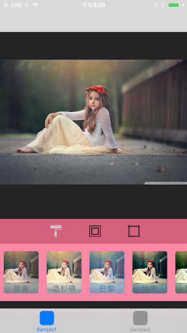

### Graphics China 特效处理 SDK (GCImageSDK) [English Version](README.md)

#### 先决条件

- GPUImage An open source iOS framework for GPU-based image and video processing
	- https://github.com/BradLarson/GPUImage
- opencv Open Source Computer Vision Library
	- https://github.com/Itseez/opencv
	- http://opencv.org

GCImageSDK 需要 GPUImage 和 opencv 的支持。这两个框架库已经包含在提供给开发者的 zip 包中。

#### SDK 为开发者提供两个版本

- 版本一：GCImageSDK 只提供特效分类和特效相关的接口，以及参数调节等，也就是 GCImageSDK.framework；
	
- 版本二：GCImage+UISDK 除了提供 GCImageSDK 所具备的特效分类和特效相关的接口、参数调节功能外，还提供功能完整的特效处理 UI 界面，包括，照片选择界面、特效处理界面和设置界面等，也就是 GCImage+UISDK.framework。

#### SDK 环境

- SDK 支持从 iOS5 ~ iOS8
- SDK 内建所有架构，包括 arm64、armv7s、armv7、x86_64 和 i386

#### GCImageSDK 文件和模块功能说明

| 模块 | 说明 
|------------|--------
|GCImageSDK.framework | GCImageSDK 核心库和接口
|GCImage+UISDK.framework | GCImageSDK 核心 + UI 模块库
|GCImageSDKPreload.bundle | GCImageSDK 预置的特效相关资源
|GCImage+UISDK.bundle | GCImageSDK UI 资源包
|GPUImage.framework | GPUImage 第三方库
|opencv2.framework | OpenCV 第三方库

#### XCode 项目设置

- 链接参数：
在 Linking 项的 Other Linker Flags 中增加 ```-ObjC```


- 链接的系统库和第三方库：

|系统库     |  第三方库   |
|-----|------|
|Accelerate.framework| |
|AssetsLibrary.framework|
|MessageUI.framework|
|CoreLocation.framework|
|CoreTelephony.framework|
|SystemConfiguration.framework|
|GLKView.framework|
|libc++.dylib|
|libsqlite3.dylib|
||GPUImage.framework|
||opencv.framework|


- info 选项

View controller-based status bar appearance 设置为 ```NO```


#### 如何使用 SDK

##### SDK 嵌入方式一

如果开发者愿意使用 SDK 提供的 UI 控件来管理特效处理流程，那么使用 GCImageSDK 核心 + UI 模块库，也即 GCImage+UISDK.framework。除了核心特效模块，

| 核心类  | 说明  |
|---------|-------|
|GCImageFilterContext| 特效处理上下文环境类，提供一系列接口来获取所有和特效处理相关的信息。如，支持的“特效系列”、支持的“特效”，创建特效所需要的参数，等等。|
|GCImageFilter| 特效处理类，接受输入图像，执行特效处理，并输出处理后的图像。|
|GCImageMacroFilter| 特效处理叠加类，这个类接受输入图像，并可使用一系列叠加的特效，并输出处理后的图像；也提供诸如追加、删除、撤销(Undo)、重做(Redo)等一系列功能。|
|GCImageFilterCategoryInfo| 特效分类信息类，提供特效分类相关的数据，如名称、描述、以及属于此类别的所有特效信息。|
|GCImageFilterInfo| 特效信息类，提供特效相关的数据，如名称、描述、参数、以及所属的特效分类，除此之外，为了方便开发者，也同时提供了调节参数的控件组、控件面板等，开发者可以直接将控件面板显示在界面上，控件组上的控件直接与对应的特效参数关联，通过调节控件来达到调节参数的目的。|

此 framework 中也提供了 UI 模块的实现，包括，

| 界面类  | 说明  |
|---------|-------|
|GCImagePickerViewController| 照片选择界面|
|GCSettingsViewController| 系统设置界面|
|GCImageFilterViewController| 特效处理界面(ViewController)|
|GCImageFilterView| 特效处理界面(View)|

SDK 包中的 GCImage+UISDKDemo 中包含了几种使用 SDK UI 控件的方式，


- 从 GCImagePickerViewController 开始。也就是开发者使用 SDK 提供的照片选择界面，用户从这个界面选择照片，然后进入特效处理界面，最终完成照片处理。


```
...
    GCImagePickerViewController *viewController = gc_as_autorelease([[GCImagePickerViewController alloc] init]);
    
    [self.navigationController pushViewController:viewController animated:YES];
...

```

- 从 GCImageFilterViewController 开始。先准备好照片，然后直接展示特效处理界面，并最终完成照片处理，


```
...

    UIImage *sampleImage = [UIImage imageNamed:@"sample_image2.jpg"];
    GCImageFilterViewController *viewController = gc_as_autorelease([[GCImageFilterViewController alloc] initWithInputImage:sampleImage completionHandler:^(UIImage *filteredImage) {
        
    }]);
    
    UINavigationController *navigationController = gc_as_autorelease([[UINavigationController alloc] initWithRootViewController:viewController]);
    
    [self presentViewController:navigationController animated:YES completion:^{
        
    }];

...

```

- 从 GCImageFilterView 开始。有时候，开发者需要更细粒度的界面，如，希望 View Controller 的风格和 App 的其它部分一致，也就是不希望使用 GCImageFilterViewController 的 Navigation Bar，那么可以直接使用 GCImageFilterView 来达成目的。




```
...
    CGFloat navigationBarHeight = self.navigationController.navigationBar.frame.size.height;
    CGFloat statusBarHeight = [UIApplication sharedApplication].statusBarFrame.size.height;
    
    UIViewController *viewController1 = gc_as_autorelease([[UIViewController alloc] init]);
    GCImageFilterView *imageFilterView1 = nil;

    if (IS_IOS_7) {
        imageFilterView1 = [[GCImageFilterView alloc] initWithFrame:CGRectMake(0.0f, 0.0f, self.view.bounds.size.width, self.view.bounds.size.height-navigationBarHeight-statusBarHeight) completionHandler:^(UIImage *filteredImage) {
            NSLog(@"Filtered image: %@", filteredImage);
        }];
    }
    else {
        imageFilterView1 = [[GCImageFilterView alloc] initWithFrame:CGRectMake(0.0f, 0.0f, self.view.bounds.size.width, self.view.bounds.size.height-navigationBarHeight) completionHandler:^(UIImage *filteredImage) {
            NSLog(@"Filtered image: %@", filteredImage);
        }];
    }
    
    UIImage *sampleImage1 = [UIImage imageNamed:@"sample_image4.jpg"];
    [imageFilterView1 setInputImage:sampleImage1];
    [imageFilterView1 setNavigationBarHeight:navigationBarHeight];
    [imageFilterView1 setStatusBarHeight:statusBarHeight];
    [imageFilterView1 setContentMode:UIViewContentModeScaleAspectFit];
    [viewController1 setView:imageFilterView1];
    
    UIViewController *viewController2 = gc_as_autorelease([[UIViewController alloc] init]);
    GCImageFilterView *imageFilterView2 = nil;
    
    
    if (IS_IOS_7) {
        imageFilterView2 = [[GCImageFilterView alloc] initWithFrame:CGRectMake(0.0f, 0.0f, self.view.bounds.size.width, self.view.bounds.size.height-navigationBarHeight-statusBarHeight) completionHandler:^(UIImage *filteredImage) {
            NSLog(@"Filtered image: %@", filteredImage);
        }];
    }
    else {
        imageFilterView2 = [[GCImageFilterView alloc] initWithFrame:CGRectMake(0.0f, 0.0f, self.view.bounds.size.width, self.view.bounds.size.height-navigationBarHeight) completionHandler:^(UIImage *filteredImage) {
            NSLog(@"Filtered image: %@", filteredImage);
        }];
    }
    
    UIImage *sampleImage2 = [UIImage imageNamed:@"sample_image3.jpg"];
    [imageFilterView2 setInputImage:sampleImage2];
    [imageFilterView2 setNavigationBarHeight:navigationBarHeight];
    [imageFilterView2 setStatusBarHeight:statusBarHeight];
    [imageFilterView2 setContentMode:UIViewContentModeScaleAspectFit];
    [viewController2 setView:imageFilterView2];

    UITabBarController *tabViewController = gc_as_autorelease([[UITabBarController alloc] init]);
    [tabViewController setDelegate:self];
    [tabViewController setViewControllers:[NSArray arrayWithObjects:viewController1, viewController2, nil] animated:YES];
    
    UINavigationController *navigationController = gc_as_autorelease([[UINavigationController alloc] initWithRootViewController:tabViewController]);
    
    [self presentViewController:navigationController animated:YES completion:^{
        [viewController1.tabBarItem setTitle:@"Sample1"];
        [viewController1.tabBarItem setImage:[UIImage imageNamed:@"spotlight29.png"]];

        [viewController2.tabBarItem setTitle:@"Sample2"];
        [viewController2.tabBarItem setImage:[UIImage imageNamed:@"spotlight29.png"]];
    }];

...

```


更多详细的使用方法，请参见 SDK 包中的 GCImage+UISDKDemo。

##### SDK 嵌入方式二

如果开发者希望自己编写 UI 控件来控制特效处理流程，那么使用 GCImageSDK 核心库，也即 GCImageSDK.framework，

| 核心类  | 说明  |
|---------|-------|
|GCImageFilterContext| 特效处理上下文环境类，提供一系列接口来获取所有和特效处理相关的信息。如，支持的“特效系列”、支持的“特效”，创建特效所需要的参数，等等。|
|GCImageFilter| 特效处理类，接受输入图像，执行特效处理，并输出处理后的图像。|
|GCImageMacroFilter| 特效处理叠加类，这个类接受输入图像，并可使用一系列叠加的特效，并输出处理后的图像；也提供诸如追加、删除、撤销(Undo)、重做(Redo)等一系列功能。|
|GCImageFilterCategoryInfo| 特效分类信息类，提供特效分类相关的数据，如名称、描述、以及属于此类别的所有特效信息。|
|GCImageFilterInfo| 特效信息类，提供特效相关的数据，如名称、描述、参数、以及所属的特效分类，除此之外，为了方便开发者，也同时提供了调节参数的控件组、控件面板等，开发者可以直接将控件面板显示在界面上，控件组上的控件直接与对应的特效参数关联，通过调节控件来达到调节参数的目的。|

SDK 包中的 GCImageSDKDemo 展示了如何获取特效处理相关的信息，以及如何完成特效处理流程；也简单地展示了如何结合控件来协同工作。开发者可以根据需要来决定使用何种控件。


- 获取支持的特效分类(系列)


特效分类会不断增加，并随新版本更新，或在线更新。

- 获取某个分类下的所有特效


新特效也正在不断增加，并随新版本更新，或在线更新。

- 应用特效，并查看效果


- 使用 Macro 特效功能，组合多个特效效果，并可以 Undo/Redo/Add/Remove/Reset 等


更多详细的使用方法，请参见 SDK 包中的 GCImageSDKDemo。

#### 参考实现

可图(CoGraphics)是 GCImageSDK 的一个参考实现，展现了通过 GCImageSDK 可以实现所有的功能。您可以

- 在 App Store 搜索 “CoGraphics” 或者“可图”来找到它；
- https://itunes.apple.com/us/app/cographics/id988889205?l=zh&ls=1&mt=8 直接在 App Store 中访问。

