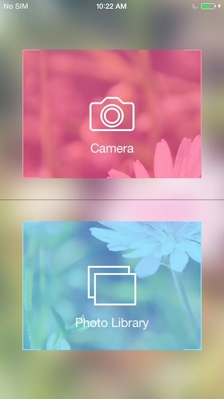
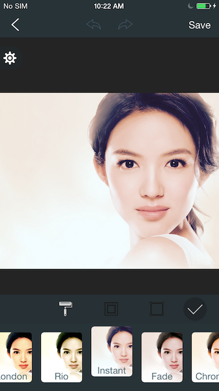
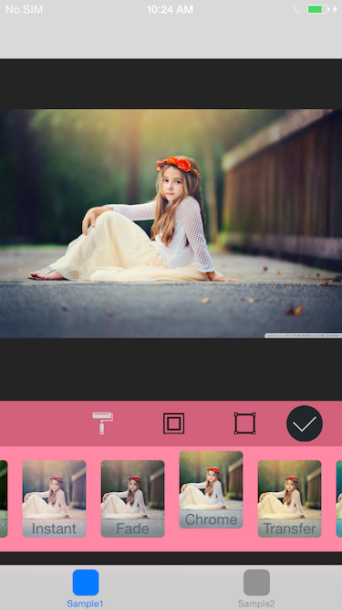
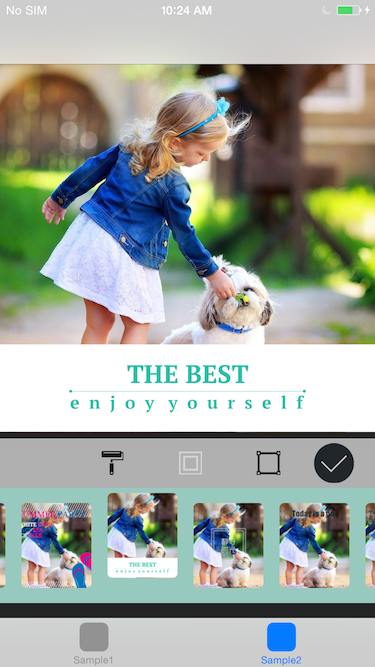
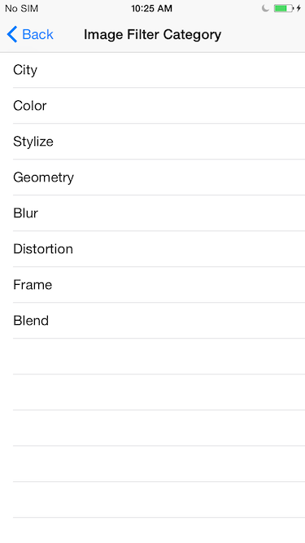
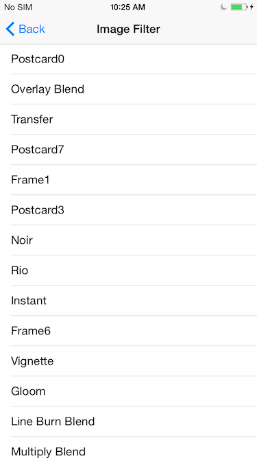
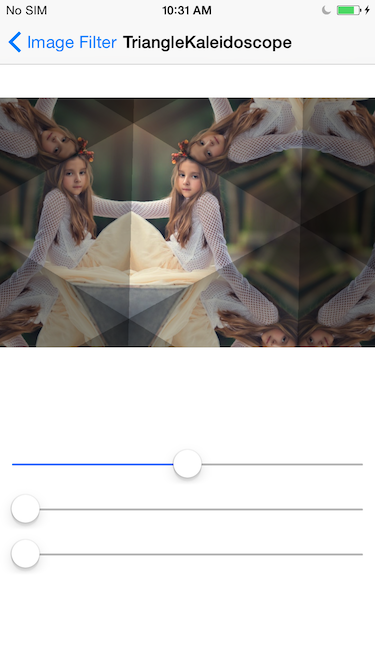
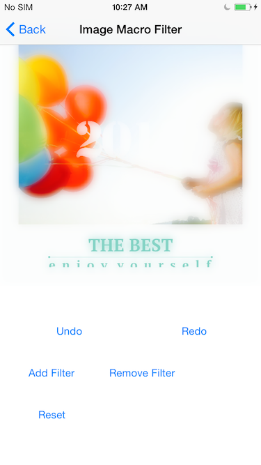

### Graphics China Image Filtering SDK (GCImageSDK) [中文版](./README-CN.md)
 
#### Prerequisites

- GPUImage An open source iOS framework for GPU-based image and video processing
	- https://github.com/BradLarson/GPUImage
- opencv Open Source Computer Vision Library
	- https://github.com/Itseez/opencv
	- http://opencv.org

GCImageSDK requires GPUImage and opencv. You can find GPUImage(GPUImage.framework) and opencv(opencv2.framework) in the final release package.

#### SDK Versions for Developers

- Version 1: GCImageSDK is the core library. It is for the developers whose prefer to handle everything during the image processing, including UI. It provides developers a set of interfaces for image filter categories, and image filters. It also provides a full functional interface set for the parameter adjustments, etc. Developers just import GCImageSDK.framework and GCImageSDKPreload.bundle to use it. 
	
- Version 2: GCImage+UISDK is the core library plus the GUI Kit Library. It is for the developers whose wants to add the image processing functionality into apps with a few lines of code, and don't want to write a complicated image filtering UI by themselves. It provides developers not only the interfaces in the core library, but also a full functional UIKit for image processing, including the UI controls or controllers for image picking, image filtering, and settings, etc. Developers should import GCImage+UISDK.framework, GCImage+UISDK.bundle and GCImageSDKPreload.bundle to use it.

#### SDK Environment

- SDK supports iOS5.1.1 ~ iOS8.x
- SDK built-in all architectures, including arm64, armv7s, armv7, x86_64 and i386

#### GCImageSDK Files and Modules Description

| Module | Description 
|------------|--------
|GCImageSDK.framework | GCImageSDK core library and interfaces
|GCImage+UISDK.framework | GCImageSDK core + UI library and interfaces
|GCImageSDKPreload.bundle | GCImageSDK preloaded resources
|GCImage+UISDK.bundle | GCImage+UISDK UI bundle
|GPUImage.framework | GPUImage library(third-party)
|opencv2.framework | OpenCV library(third-party)

#### XCode Project Settings

- Linking section：
In the Linking section, in Other Linker Flags, add the flag ```-ObjC```


- System and third-party frameworks and libraries required,

|System     |  Third-party   |
|-----|------|
|Accelerate.framework| |
|AssetsLibrary.framework|
|MessageUI.framework|
|CoreLocation.framework|
|CoreTelephony.framework|
|SystemConfiguration.framework|
|GLKView.framework|
|libc++.dylib|
|libsqlite3.dylib|
||GPUImage.framework|
||opencv.framework|


- info section

View controller-based status bar appearance set to ```NO```


#### How to use SDK

##### SDK Usage Mode 1

If developers want to use the least code and spend the least time to enable the image processing capability in their apps, and then use GCImageSDK core+UI library, i.e., GCImage+UISDK.framework. The core classes are listed below,

| Core Class  | Description  |
|---------|-------|
|GCImageFilterContext| Image filtering context. It provides some interfaces to get all info about image filter processing, such as, supported filter categories, supported filters, parameters to create a image filter, etc.|
|GCImageFilter| The core image filtering class. It take a input image, and then execute filtering, finally output the filtered image.|
|GCImageMacroFilter| Batch image filtering class. It take a input image, and then can add one or more image filters on the input image, finally output the filtered image; It also provides a set of interfaces for the batch, such as Add, Remove, Undo, Redo, Reset, etc.|
|GCImageFilterCategoryInfo| Image filter category info class. It provides the info about a filter category for search or display, such as the category name, description, and other properties.|
|GCImageFilterInfo| Image filter class. It provides the info about a filter for search, display and control, etc. For example, the filter name, description, parameters, and the category it belong to. Except for this, it also provides developers a overlay view and a set of controls for the filter parameter adjustment. The developers could put the overlay view on the UI, each control in the overlay is for a specified filter parameter, so users can adjust one or more filter parameters by the controls.|

Except the above core classes, the framework also provides developers some UI controls, incuding,

| UI Class  | Description  |
|---------|-------|
|GCImagePickerViewController| The view controller for picking a picture from the photo library.|
|GCSettingsViewController| The view controller for system settings.|
|GCImageFilterViewController| The view controller for image filtering.|
|GCImageFilterView| The view for image filtering. |

There are several ways to complete the image filtering process by the UI classes. You can find them from GCImage+UISDKDemo in the SDK,


- Start from GCImagePickerViewController. A developer can show the image picker view controller, and then a user picks a image and complete the image filtering process in the next GCImageFilterViewController.



```
...
    GCImagePickerViewController *viewController = gc_as_autorelease([[GCImagePickerViewController alloc] init]);
    
    [self.navigationController pushViewController:viewController animated:YES];
...

```

- Start from GCImageFilterViewController. If a developer don't want to use GCImagePickerViewController, and prepare a image by himself, so just present the view controller directly. Finally a user can complete the image filtering process in the controller.



```
...

    UIImage *sampleImage = [UIImage imageNamed:@"sample_image2.jpg"];
    GCImageFilterViewController *viewController = gc_as_autorelease([[GCImageFilterViewController alloc] initWithInputImage:sampleImage completionHandler:^(UIImage *filteredImage) {
        
    }]);
    
    UINavigationController *navigationController = gc_as_autorelease([[UINavigationController alloc] initWithRootViewController:viewController]);
    
    [self presentViewController:navigationController animated:YES completion:^{
        
    }];

...

```

- Start from GCImageFilterView. Sometimes, a developer want a much more fine gain control for UI, for example, want the style of the image filtering view controller is same as other view controllers in his project. i.e., the developer don't want the navigation bar of GCImageFilterViewController. So the developer could use GCImageFilterView directly to fulfill this requirement. The code in the demo shows developers how to embeded GCImageFilterView into their own view controllers.




```
...
    CGFloat navigationBarHeight = self.navigationController.navigationBar.frame.size.height;
    CGFloat statusBarHeight = [UIApplication sharedApplication].statusBarFrame.size.height;
    
    UIViewController *viewController1 = gc_as_autorelease([[UIViewController alloc] init]);
    GCImageFilterView *imageFilterView1 = nil;

    if (IS_IOS_7) {
        imageFilterView1 = [[GCImageFilterView alloc] initWithFrame:CGRectMake(0.0f, 0.0f, self.view.bounds.size.width, self.view.bounds.size.height-navigationBarHeight-statusBarHeight) completionHandler:^(UIImage *filteredImage) {
            NSLog(@"Filtered image: %@", filteredImage);
        }];
    }
    else {
        imageFilterView1 = [[GCImageFilterView alloc] initWithFrame:CGRectMake(0.0f, 0.0f, self.view.bounds.size.width, self.view.bounds.size.height-navigationBarHeight) completionHandler:^(UIImage *filteredImage) {
            NSLog(@"Filtered image: %@", filteredImage);
        }];
    }
    
    UIImage *sampleImage1 = [UIImage imageNamed:@"sample_image4.jpg"];
    [imageFilterView1 setInputImage:sampleImage1];
    [imageFilterView1 setNavigationBarHeight:navigationBarHeight];
    [imageFilterView1 setStatusBarHeight:statusBarHeight];
    [imageFilterView1 setContentMode:UIViewContentModeScaleAspectFit];
    [viewController1 setView:imageFilterView1];
    
    UIViewController *viewController2 = gc_as_autorelease([[UIViewController alloc] init]);
    GCImageFilterView *imageFilterView2 = nil;
    
    
    if (IS_IOS_7) {
        imageFilterView2 = [[GCImageFilterView alloc] initWithFrame:CGRectMake(0.0f, 0.0f, self.view.bounds.size.width, self.view.bounds.size.height-navigationBarHeight-statusBarHeight) completionHandler:^(UIImage *filteredImage) {
            NSLog(@"Filtered image: %@", filteredImage);
        }];
    }
    else {
        imageFilterView2 = [[GCImageFilterView alloc] initWithFrame:CGRectMake(0.0f, 0.0f, self.view.bounds.size.width, self.view.bounds.size.height-navigationBarHeight) completionHandler:^(UIImage *filteredImage) {
            NSLog(@"Filtered image: %@", filteredImage);
        }];
    }
    
    UIImage *sampleImage2 = [UIImage imageNamed:@"sample_image3.jpg"];
    [imageFilterView2 setInputImage:sampleImage2];
    [imageFilterView2 setNavigationBarHeight:navigationBarHeight];
    [imageFilterView2 setStatusBarHeight:statusBarHeight];
    [imageFilterView2 setContentMode:UIViewContentModeScaleAspectFit];
    [viewController2 setView:imageFilterView2];

    UITabBarController *tabViewController = gc_as_autorelease([[UITabBarController alloc] init]);
    [tabViewController setDelegate:self];
    [tabViewController setViewControllers:[NSArray arrayWithObjects:viewController1, viewController2, nil] animated:YES];
    
    UINavigationController *navigationController = gc_as_autorelease([[UINavigationController alloc] initWithRootViewController:tabViewController]);
    
    [self presentViewController:navigationController animated:YES completion:^{
        [viewController1.tabBarItem setTitle:@"Sample1"];
        [viewController1.tabBarItem setImage:[UIImage imageNamed:@"spotlight29.png"]];

        [viewController2.tabBarItem setTitle:@"Sample2"];
        [viewController2.tabBarItem setImage:[UIImage imageNamed:@"spotlight29.png"]];
    }];

...

```


More detailed info about GCImage+UISDK usage, please see the GCImage+UISDKDemo project in the package.

##### SDK Usage Mode 2

If a developer want to write his/her own UI control to handle everything in the image filtering process, and then the developer could use GCImageSDK core library directly, i.e., GCImageSDK.framework.

| Core Class  | Description  |
|---------|-------|
|GCImageFilterContext| Image filtering context. It provides some interfaces to get all info about image filter processing, such as, supported filter categories, supported filters, parameters to create a image filter, etc.|
|GCImageFilter| The core image filtering class. It take a input image, and then execute filtering, finally output the filtered image.|
|GCImageMacroFilter| Batch image filtering class. It take a input image, and then can add one or more image filters on the input image, finally output the filtered image; It also provides a set of interfaces for the batch, such as Add, Remove, Undo, Redo, Reset, etc.|
|GCImageFilterCategoryInfo| Image filter category info class. It provides the info about a filter category for search or display, such as the category name, description, and other properties.|
|GCImageFilterInfo| Image filter class. It provides the info about a filter for search, display and control, etc. For example, the filter name, description, parameters, and the category it belong to. Except for this, it also provides developers a overlay view and a set of controls for the filter parameter adjustment. The developers could put the overlay view on the UI, each control in the overlay is for a specified filter parameter, so users can adjust one or more filter parameters by the controls.|

GCImageSDKDemo in the package shows how to query all necessary info about the image filtering process, and how to complete the process; It also shows how to  the intefaces in the core library works with some simple system controls, such as, the table view, the slider, etc.


- Query all supported image filter categories(family)



more categories will be added continually, and could be updated online.

- Query all image filters in a category



more filters will be added continually, and could be updated online.

- Apply a image filter, and show the filtered image



- Use macro filter to combine multiple filters, and can Undo/Redo/Add/Remove/Reset, etc.



More detailed info about GCImageSDK usage, please see the GCImageSDKDemo project in the package.

